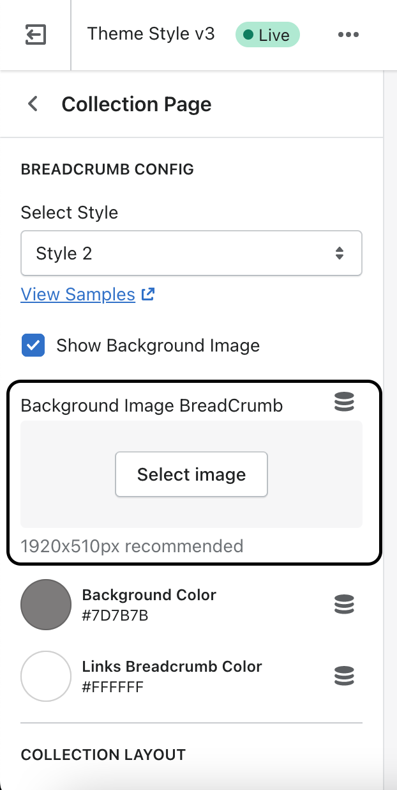
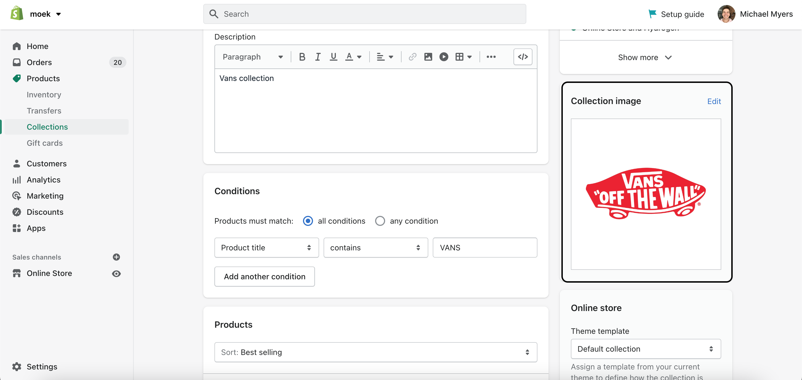

## Modify collection.template.liquid file
```liquid
 style="background-image : 
url({{section.settings.bg_breadcrumb | img_url : 'master'}}
   {{ collection.image | image_url: width: 2048 }}
  
   //via.placeholder.com/1920x300
   ); background-position : center; background-size: cover" style="background-color : {{section.settings.bg_color_breadcrumb}}">
```

## Be sure you don't have picked an image in the admin panel
If so, unpick it because you'll not be able to see a different background images.


## Set collection image


## How it works? 
If your section don't have a background image then collection image will show up. If you don't have a collection image, then you will see a dummy image from the theme.

## If you have another theme
If your theme is not Larine. You can try to use this code, but I think it will work not correctly. So, you need to change a dummy image first, because 100% you don't have a file with this name in your theme. Next you should check a sections name. If they are the same, then alright, if no - you need to change them.

## Overall 
That's it. Super simple and looks great. Use high resolution images as a collection image and all will be fine. If you have any questions you can send me a message and I'll try all my best to help you. Also, I have [YouTube channel](https://www.youtube.com/channel/UCJ7a90E4ZflmScpRxfyyeCw) where you can check videos about Shopify(and more). I'm posting videos not so often, because have 2 more channels, but I'm trying. 