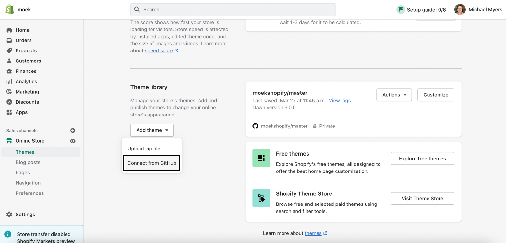
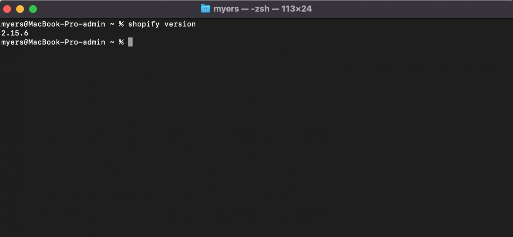
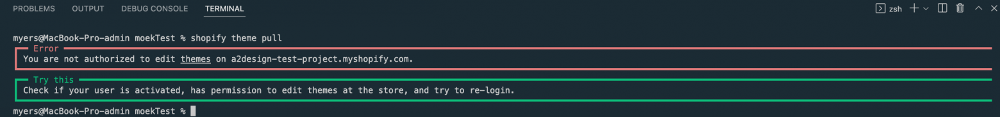
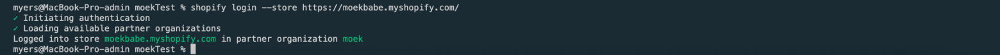
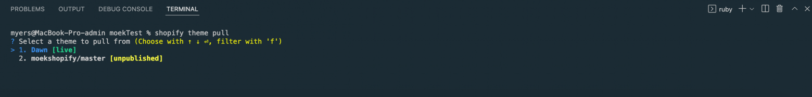
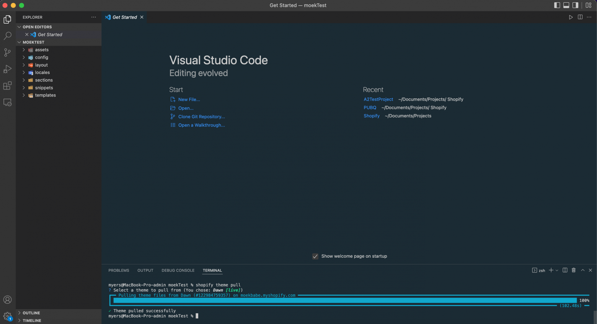
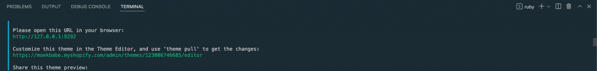
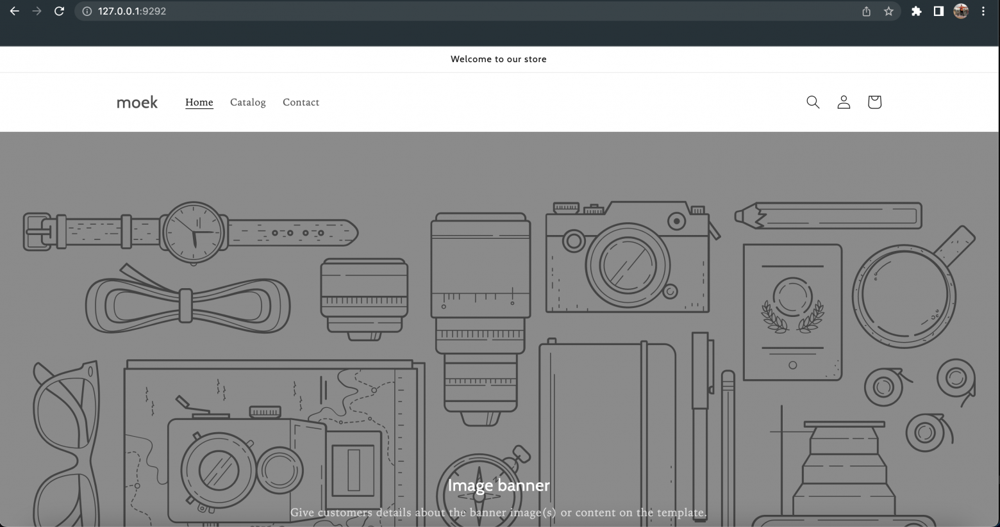
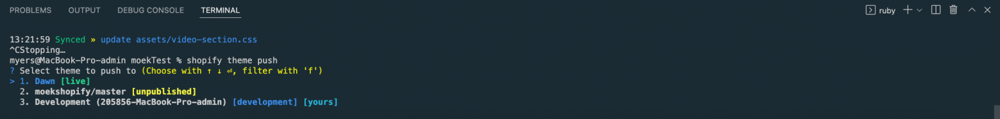

## How I started?
I wrote an article several months ago when landed a job as a Shopify Developer. You can read it [here](https://medium.com/@devmoek/my-journey-from-zero-to-got-an-offer-in-tech-company-b1718ca8ab20). Now I boosted my skills and feel myself much better with Shopify. By the way, I don't have enough experience to develop headless e-commerce websites which is [Hydrogen](https://hydrogen.shopify.dev/), but I'm on the way. I took Udemy courses to learn React to be able to write clean and perfomance code.

When I found the job, my experience with Shopify was almost a zero. I had understanding about HTML, CSS, JS but my experience with JSON, liquid and Shopify platform as well was not enough to do what I develop and customize now. And this is great. It means my skills is growing. 

## Vintage themes
When I just came to the company there was several Shopify project with a vintage theme. It's now called like that because we have 2.0 themes. So these themes, vintage ones, it's less customizable then 2.0 themes. And I understood that, especially when worked with 2.0 themes and after that maintain a vintage one, it feels different. First things first is JSON templates.

## JSON templates
In vintage themes you will see liquid templates. For example `page.liquid`. Liquid templates less handy when you need to add some new content to website's pages. When you have JSON templates, you will be able to add any section you have in sections folder to any page with `.json` extension.

## Third party themes vs Shopify themes
You can see a whole bunch of themes out there. And probably you have a reasonable question like **What theme should I choose for my store?** So it's a complex question and you need to understand what you'll do with your store. I mean *how* you want to prepare it and *who* will do that. You can hire a developer or do all work by yourself. In my experience, third party themes are not good (not all, but a lot). You need to check a theme you want to buy, like check-check and check, a lot of check. Not just check the design and say something like yeah it's nice let's go create a store.

By the way, I think not all theme developers will show the code. I sure everyone will decline a request to show a theme code. Why you need to check the code? In the code you can see mistakes, errors, etc. I saw that with my eyes and this experience is not good at all. If you are just started learning Shopify development, I'll recommend [Dawn theme](https://themes.shopify.com/themes/dawn/styles/default) to start with. It's super optimized and have a clean code. Oh, and Dawn have all you need under the hood to launch a store. Almost all. There is no recently viewed items section functionality. But I have a video on my YouTube channel about [how to add recently viewed items section in Shopify Dawn theme](https://www.youtube.com/watch?v=gk7KzAFPP5E&t). 

## Tips and tricks
These tips can help you to land a Shopify store:
1. Check theme documentation (if you bought a thirt-party theme). In a theme documentation you will read a guide from a theme developer, where to find some features, what apps you need in a theme and much more.
2. Connect your theme from GitHub repository. This will help you to track all changes in your theme. I have a video on my YouTube channel how to sync a theme from github, [link](https://www.youtube.com/shorts/LVZu7M1-BNc).


3. Change pages templates from liquid to JSON (if you don't have it). I wrote before why it's important.
4. Before doing some changes in your live theme, don't forget to create a theme copy. Or, if you are using a GitHub integration you can create another branch for development, like `dev`.
5. Use Shopify CLI. It's more handy than the Shopify code editor. Especially new one, it's so laggy and it's unreal work in it.

Now I'm going to tell you my daily routine as a Shopify developer.

## Shopify CLI
Shopify CLI is a command-line interface tool that helps you build Shopify apps. It quickly generates Shopify apps and scaffolds app extensions. Shortly, it's a handy feature that will help you to work way faster. 

### How to install Shopify CLI?
Before you will install it, you need to do some preparations:
* [Install Ruby](https://www.ruby-lang.org/en/downloads/)
* [Install Git](https://git-scm.com/downloads)
* [Create a Shopify Partner Account](https://accounts.shopify.com/signup) (if you don't have it)

#### Installation on macOS (Homebrew)

```
brew tap shopify/shopify
brew install shopify-cli

```

#### Installation on Windows (RubyGems.org)

```
gem install shopify-cli

```

#### Check a Shopify CLI version

``` 
shopify version
```

If you successfuly done previous steps you will see the version in a terminal



You can also write commands in Visual Studio Code terminal, it doesn't matter. 

#### Authentication 
Use `shopify login` command to login in a specific store. For example:
```
shopify login --store https://moek.myshopify.com
```

`--store` is a very important key here. You can't login to the store without it. 

Before I will show you more commands in action. I want to tell you about one thing. And this thing is if you have a partner account and if you would like to login to the store using this account you will get a Shopify CLI error message. Like that:



To fix this issue I created another account and added email of the account as a staff. And now I be able to login to the stores. You will see something like that:



#### Get all theme files to a folder
Let's create a folder and try to pull all files from Shopify to the directory. To do this use this command: 
```
shopify theme pull
```

You'll get this message. Choose a theme you'll pull files from. In my case it will be the first one:



You'll need to wait some time, depends on how much files you have. In the end of the proccess you will see a successful message:


The next useful command is 

```
shopify theme serve

```

This command create a local version of our store and we can see the changes in quick way. I mean we don't need to push our files, goto the main store and see how it works. All things happened locally. And this is great! You will see something like this in a terminal:


Now we can use the ip we get and see how the store looks like:


To stop serving your theme press `CTRL + C`.

When you did some changes locally you can push it in your live theme. To do that use this command:

```
shopify theme push
```

You will see the message where it ask you to choose a theme to push the files.


#### Shopify CLI commands
`shopify whoami` - to see where are you location

`shopify version` - to get info about the current shopify cli version

`shopify theme list` - to get all themes in your store

`shopify switch --store storeurl.myshopify.com` - to switch between stores which located in your partner organization

`shopify populate customers l draftorders l products` - to add customers, draft orders, products

`shopify logout` - to exit from the shopify store

It's not all Shopify CLI commands. To get the whole list use: 
```
shopify --help

```

Congratulations! Now you understand how to work with Shopify CLI.

## VS Code extensions
VS Code offer some plugins that can help you to develop / customize Shopify themes even faster. I'll show you them, but I can't say that all of them are useful and something like that.

1. Liquid
2. Liquid Snippet Include Detection
3. Shopify Content Schema
4. Shopify Liquid
5. Shopify Liquid Template Snippets

## Overall
Being a Shopify Developer is great. I love e-commerce so much and to be a part of this is proud for me. Also, I like Hydrogen - React-based framework to build a headless ecommerce stores. Sounds awesome!